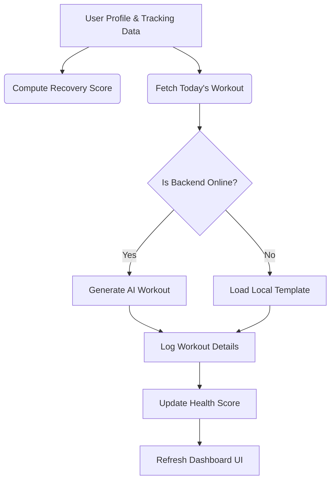

# Fitrova - Comprehensive System Documentation
## CHAPTER ONE: INTRODUCTION

### 1.1 Background of the Study
In the modern digital age, the paradigm of fitness and health tracking has undergone a massive shift. Historically, individuals relied on personal trainers, paper logs, or static workout plans to manage their fitness journeys. This approach was highly manual, expensive, and lacked personalization, making it difficult for users to track progress and stay motivated over time.

With the proliferation of mobile applications, digital fitness systems like MyFitnessPal, Strava, and Fitbod have emerged. These applications provide centralized trackers for nutrition, running routes, and strength exercises. However, many current systems suffer from rigid scheduling, lack of robust offline fallback mechanisms, complex setup requirements, and a high susceptibility to fake registrations that degrade server performance.

Fitrova is designed to overcome these challenges by offering a premium, intelligent, and highly responsive mobile fitness application. Featuring an emerald-themed glassmorphic interface, Fitrova integrates personalized AI workout scheduling, dynamic nutrition logging, and secure monetization. By using a dual-mode architecture, Fitrova remains fully functional via local templates even when network connection to the AI backend is lost, ensuring an uninterrupted user experience.

Additionally, in many growing fitness markets, access to affordable, personalized guidance is limited. Fitrova bridges this gap by providing high-quality AI-driven training plans that adapt to the user's specific progress, fitness level, and recovery score. The system is designed to be lightweight, secure, and deployable in standard web hosting environments.

### 1.2 Statement of the Problem
Despite the popularity of digital health trackers, several major problems persist in the industry. For developers and system administrators, database pollution from disposable/fake email registrations degrades system security and increases server costs. For users, standard fitness apps offer rigid calendars that fail to adjust when a workout is missed, leading to a sense of failure and disengagement.

Another challenge is the lack of robust offline support. When an app relies entirely on cloud-based AI endpoints for generating workouts, any network failure results in crashes or blank screens, disrupting the user's routine at the gym. Furthermore, many fitness apps lack a unified metric that summarizes the user's overall daily health consistency, forcing them to sift through disjointed charts.

Fitrova addresses these problems by:
1. Providing administrators with real-time email validation using Abstract API to block temporary and disposable registration domains.
2. Offering an intelligent workout rescheduling algorithm that rolls forward missed sessions and calculates real-time recovery metrics.
3. Ensuring the system falls back gracefully to pre-configured local templates when network connections to the AI services fail, avoiding user disruption.
4. Calculating a dynamic Health Score out of 100 on the dashboard to summarize nutritional, physical, and consistency metrics in one visual progress ring.

### 1.3 Aim and Objectives
The primary aim of this study is to develop and document the Fitrova platform, with a focus on creating a personalized, secure, and resilient mobile fitness application.

Specific Objectives:
* **To design a secure onboarding questionnaire:** Ensuring that users can easily sign up, input their height, weight, goals, and activity level to initialize their profile.
* **To create a real-time health score dashboard:** Allowing users to track their daily calorie budget, macronutrient logs, and weight trends in a unified interface.
* **To develop an adaptive AI workout recommendation engine:** Recommending routines based on profiles and recovery metrics, with automatic missed workout rescheduling.
* **To secure registrations and subscriptions:** Integrating Abstract API to filter fake registration emails and Paystack to manage secure subscriptions.
* **To implement robust offline fallbacks:** Allowing the application to transition seamlessly to offline templates when AI APIs are unreachable.

### 1.4 Significance of the Study
The significance of this study lies in the improvement of personalized fitness tracking. By reducing the time and cost to design custom workout programs, Fitrova provides professional health tracking for users at all levels.

For users, the platform reduces the friction of staying consistent. If a workout is missed, the system rolls it forward without penalizing them, while the Health Score gamifies daily tracking.

For administrators, the platform filters out temporary registrations, protecting server resources. The modular dual-mode architecture allows hosting on standard XAMPP servers or scalable cloud systems.

On a broader scale, Fitrova contributes to the field of mobile health, showing how APIs (Gemini, Paystack, Abstract API) can be combined with hybrid frameworks (React Native, PHP REST API) to build lightweight, robust wellness applications.

### 1.5 Definition of Terms
* **Active User / Fitness Enthusiast:** An individual actively tracking their physical fitness, meals, and weight using the mobile application.
* **Fitness Administrator:** An administrative user responsible for managing user accounts, exercise libraries, subscription statuses, and database integrity.
* **Health Score:** A dynamic metric (0-100) calculated daily based on calories logged, workouts finished, and weight logging consistency.
* **Workout Plan:** A calendar routine generated by the AI matching engine detailing exercises, sets, reps, and durations.
* **Recovery Score:** A calculated percentage (up to 98%) estimating the user's muscle recovery status based on historical training volume.
* **Abstract API:** A third-party verification service integrated into signup to block disposable and fake registration domains.
* **Paystack:** A payment processing gateway integrated into the application to securely handle user subscription billing.
* **Dual-Mode AI Engine:** A system configuration enabling the app to fetch plans from a Flask backend, or degrade to local templates if offline.
* **React Native Expo:** A framework for universal React applications, allowing the frontend to run natively on Android, iOS, and Web.
* **PHP RESTful API:** The core backend layer handling authentication, databases, payments, and metrics calculations.

---

## CHAPTER TWO: LITERATURE REVIEW

### 2.1 Introduction
The integration of technology into health management has significantly altered how active users approach their fitness and wellness tracking. Online platforms and mobile apps now dominate the fitness management process, offering a wide variety of tools that facilitate macro calculations, exercise logging, and personalized training plans. Despite these advancements, there remain challenges in creating systems that effectively balance user usability, scheduling flexibility, and database security.

This chapter reviews literature relevant to online health management platforms, focusing on theoretical models that explain their functioning and the review of existing platforms to highlight their strengths and weaknesses. By critically analyzing related work, this chapter establishes the context for understanding how Fitrova differentiates itself from competitors and addresses persistent issues within the digital wellness ecosystem.

### 2.2 Theoretical Framework

#### 2.2.1 Behavioral Nudge Theory
Developed by Richard Thaler and Cass Sunstein, Nudge Theory suggests that subtle changes in choice architectures can significantly influence human behavior without restricting options. In Fitrova, this is implemented through the daily Health Score and AI insights. By showing visual progress, sending consistency notifications, and awarding points for consistent actions (like logging a meal or updating body weight), the application nudges users toward healthier habits in a positive, non-coercive manner.

#### 2.2.2 Self-Efficacy Theory
Albert Bandura's Self-Efficacy Theory states that a person's belief in their ability to succeed determines their motivation and performance. Traditional fitness apps often damage self-efficacy by marking missed workouts as "failed" or leaving calendars empty, leading to user disengagement. Fitrova's automatic workout rescheduling rolls missed workouts forward, maintaining the user's progress and building self-efficacy, while the Recovery Score provides reassuring feedback on physical preparedness.

#### 2.2.3 Technology Acceptance Model (TAM)
TAM, introduced by Fred Davis, asserts that perceived usefulness and perceived ease of use determine user adoption of a technology. Fitrova incorporates a premium, glassmorphic UI with simple navigation to maximize ease of use. Its features—such as instant email verification, automatic workout adjustments, and pay-as-you-go Paystack integration—enhance perceived usefulness by resolving critical health tracking frustrations.

#### 2.2.4 Mobile Health Security & Verification Models
In mobile health applications, user data privacy is critical. Signaling and verification models explain how trust is established. Fitrova utilizes Abstract API for real-time email verification, preventing spam accounts and securing the registration pipeline. Data transmission is secured using SSL/TLS, password encryption (bcrypt), and JSON Web Tokens (JWT) for session management, ensuring high user trust and maintaining platform integrity.

### 2.3 Review of Related Work

#### 2.3.1 MyFitnessPal
MyFitnessPal is a market leader in food and macro tracking, featuring a massive database of food items and calorie logging. It provides robust tools for users to set weight goals and track daily nutrition.
However, MyFitnessPal suffers from a cluttered interface, excessive ad placements in its free tier, and limited workout personalization. Its exercise recommendations are largely static and not dynamically adapted. Fitrova addresses this by providing an ad-free premium experience, integrating nutrition and AI-driven workout recommendations in a unified dashboard with a clear Health Score.

#### 2.3.2 Strava
Strava is a popular social fitness network focused on tracking outdoor activities like running and cycling. It utilizes GPS data to map routes, record speeds, and allow users to compete on local segments.
While Strava is excellent for social gamification and cardio tracking, it lacks nutrition logging and strength-based workout recommendations. It is not designed as a comprehensive wellness app. Fitrova bridges this gap by integrating strength workout recommendations, macro logging, and weight trend analytics alongside consistency tracking.

#### 2.3.3 Nike Run Club
Nike Run Club provides guided runs, achievements, and structured training programs specifically for runners. It focuses heavily on user motivation and community events.
Its primary limitation is its narrow focus on running and cardio. It does not provide calorie trackers or gym workout plans. Additionally, it has no native monetization options or verification safeguards. Fitrova offers a much broader wellness ecosystem, including strength routines, macro logs, and payment gateways for premium features.

#### 2.3.4 Fitbod
Fitbod is a specialized strength-training app that uses machine learning to design personalized gym workouts based on equipment availability, muscle fatigue, and past performance. Its workout builder is highly regarded.
However, Fitbod requires a paid subscription from the start, has no nutrition logging features, and does not run on web platforms seamlessly. Fitrova offers a hybrid monetization model with a free basic logging tier, Paystack checkout for premium AI features, and integrates nutrition tracking, weight history, and user connections in a single cross-platform application.

---

## CHAPTER THREE: SYSTEM ANALYSIS AND DESIGN

### 3.1 Analysis of the Existing System
The success of a fitness tracking application depends on how well it solves the pain points of active users and administrators. Before designing Fitrova, it is critical to analyze existing fitness applications to understand their limitations, strengths, and areas for improvement.

#### 3.1.1 Existing Systems Overview
Existing systems like MyFitnessPal, Strava, and Fitbod provide global access to fitness tracking and health logging. These platforms offer users nutrition databases, GPS activity tracking, and workout suggestions. However, several issues persist in these platforms:
* **Overload of generic routines:** With millions of static plans, users struggle to find routines suited to their exact fitness level and goals, leading to early dropout.
* **Lack of offline fallback:** Relying entirely on cloud APIs means that if connection drops at the gym, the user cannot load their workout.
* **Database pollution:** Signup systems without real-time email verification allow fake/spam accounts, inflating database size and increasing server costs.

#### 3.1.2 Limitations of Existing Systems
* **Active Users' Experience:** Active users face challenges such as rigid schedules that don't adjust when a workout is missed, lack of real-time recovery scoring, and lack of integration between macro trackers and workout plans.
* **System Administrators' Experience:** For administrators, managing database performance is difficult due to fake signups, and there is a lack of automated tools to initialize workout libraries or monitor health indicators.

The limitations of existing platforms highlight the need for a more efficient, secure, and offline-resilient system like Fitrova. Fitrova is designed to address these challenges by providing a user-friendly interface, advanced personalization algorithms, and system verification processes.

### 3.2 Data Collection Techniques
In the development of Fitrova, data was collected from physical fitness trainers, active gym-goers, and mobile app developers using various techniques:

#### 3.2.1 Interviews
Interviews were conducted with professional personal trainers and gym members to learn about common workout tracking frustrations and features they desire in a fitness application, focusing on:
* The most common pain points in using current platforms.
* Desired features and improvements in fitness-tracking platforms.
* Common health management challenges faced by system administrators.

#### 3.2.2 Observation & Review
* **Observation:** Observed gym members tracking their workouts, noting that many manually log exercises on paper or note apps, which is tedious and lacks recovery calculations.
* **Document Review:** Reviewed sports science literature, macro logging standards, and guidelines for recovery and behavior design (such as the Fogg Behavior Model). This review helped in identifying trends and best practices in online health management and highlighted gaps that Fitrova aims to fill.

#### 3.2.3 System Testing and Feedback
Focus groups tested early prototypes, leading to the refinement of the circular Health Score progress UI and the creation of the automatic workout fallback system.

### 3.3 Analysis of the Proposed System
The proposed Fitrova platform addresses these issues by offering an integrated React Native mobile client and PHP core REST API that streamlines fitness tracking, monetization, and database security.

#### 3.3.1 Key Features of Fitrova
* **User Registration & Verification:** Users sign up securely. Real-time email validation blocks disposable domains, and verified users complete an onboarding questionnaire.
* **Workout & Nutrition Tracking:** Users view dynamic workout suggestions, log daily meals and macros, track weight trends, and view AI insights.
* **Dashboard Analytics:** The homepage displays a dynamic Health Score based on user consistency in logging nutrition, weights, and finishing workouts.

#### 3.3.2 System Requirements
The proposed system must meet certain functional and non-functional requirements to ensure it operates efficiently and meets user needs:

**Functional Requirements:**
* User authentication and onboarding questionnaire.
* AI-driven workout recommendations and missed workout rescheduling.
* Meal logging with calorie/macro trackers.
* Weight trend analytics and dynamic Health Score calculation.
* Premium subscription billing via Paystack integration.

**Non-Functional Requirements:**
* **Security:** Bcrypt password hashing, prepared SQL statements, and API validation.
* **Reliability:** Seamless fallback to local workout templates when network fails.
* **Usability:** Responsive layouts and glassmorphic navigation across mobile platforms.

### 3.4 System Algorithm
The core of Fitrova is its workout recommendation and Health Score algorithms.

#### 3.4.1 Key Operations
* **AI Workout Generation:** Sends profile parameters to the AI model (Gemini or OpenAI). The model generates a structured JSON plan with exercises, difficulty, and duration.
* **Missed Workout Rescheduling:** If the system detects a missed workout, it automatically rolls it forward to the user's next active day, preserving the schedule.
* **Recovery Score Calculation:** Computes physical recovery status based on rest days and recent training volume.
* **Health Score Calculation:** Calculated dynamically out of 100 points: Base (50 pts), Calorie Logging (+10 pts), Workout Completion (+15 pts), Weight Logging Consistency (3+ entries in 7 days, +10 pts).

### 3.5 System Flowchart
The flowchart illustrates user flows for registration, onboarding, workout selection, and daily logging.

#### 3.5.1 Flowchart Overview
The system flowchart is divided into three main processes:
1. **User Signup & Verification:** User enters email. Abstract API validates domain. If valid, verification code is sent, user registers, and completes questionnaire.
2. **Dashboard & Tracking:** On dashboard load, backend queries MySQL to calculate Health Score, logs daily nutrition, and loads workouts.
3. **Workout Session:** App attempts to fetch AI workouts. If AI backend is down, falls back to local templates. User runs session, logs it, and database saves progress.

---

## CHAPTER FOUR: SYSTEM IMPLEMENTATION

The Fitrova application was developed using Agile methodology, with iterative sprint planning, continuous testing, and Docker orchestration.

### 4.1 Program Development
The development of Fitrova followed a structured approach using Agile methodology, which promotes iterative and incremental development. This allowed for continuous feedback and improvements throughout the development cycle. The key phases of program development included planning, design, coding, testing, and deployment.

* **Sprint 1:** Database architecture, user registration with Abstract API, and onboarding questionnaire design.
* **Sprint 2:** Home dashboard integration with circular Health Score progress, calorie trackers, and weight charts.
* **Sprint 3:** AI recommendation engine and frontend workout screen with automatic fallback modes.
* **Sprint 4:** Paystack subscription payment integration and premium tier features restriction.
* **Sprint 5:** Testing, debugging, Docker container configuration, and final deployment setup.

#### 4.1.1 Implementation Technologies
* **Frontend Development:** The frontend was developed using React Native and Expo framework. React Native enabled the creation of dynamic, native-feeling, and responsive UI components across Android and iOS platforms.
* **Backend Development:** Built using a PHP 8.1 RESTful API + Python 3.10 Flask AI Service, which processes database entries, authenticates requests, and queries language models.
* **Database Layer:** MySQL 8.0/MariaDB to ensure persistent, relational storage of user metrics, weight logs, meals, and plans.

#### 4.1.2 Testing and Debugging
Testing was integrated into each development sprint. Unit tests were written for each component, while integration tests ensured that different parts of the system worked together as intended. End-to-end testing was conducted to simulate the entire user journey, from registration to workout completion. Any bugs or issues identified during testing were logged and resolved before deployment.

#### 4.1.3 Deployment
Fitrova was deployed on a cloud-based hosting platform using Docker for containerization, allowing the system to scale easily as the user base grows. The use of containerization ensures that the system remains stable and performs consistently across different environments.

### 4.2 System Requirements

#### 4.2.1 Software Environment
* **Operating System:** Windows 10/11 (Local Development), Linux Ubuntu (Production Server).
* **Database:** MySQL 8.0 / MariaDB (relational database layer).
* **Backend:** PHP 8.1 RESTful API + Python 3.10 Flask AI Service (Option A) or Native PHP (Option B).
* **Frontend:** React Native + Expo Framework (cross-platform mobile client).
* **Containerization:** Docker & Docker Compose for multi-container orchestration.
* **Third-party APIs:** Abstract API (email validation) and Paystack (subscription billing).

#### 4.2.2 Hardware Environment
* **Server Specifications:** Quad-core CPU, 4GB RAM, 256GB SSD storage, 100Mbps bandwidth.
* **Client Specifications:** iOS or Android smartphone with internet connection.

### 4.3 System Interface
The user interface of Fitrova is designed with an emerald-green color palette, dark mode styles, and glassmorphic cards to create a premium, cohesive aesthetic.

#### 4.3.1 Active User Interface
* **Dashboard:** Displays the current Health Score progress ring, calorie tracking bar, workout card, and weight line chart.
* **Workout Screen:** Displays today's workout plan (exercises, reps, duration), upcoming workouts list, recovery score, and weekly progress tracker.
* **Nutrition Screen:** Logs daily meals (breakfast, lunch, dinner, snack) and shows carbohydrates, proteins, and fats macros.
* **Profile & Settings:** Allows editing profile goals, current weight, and managing connections.
* **Monetization Page:** Manages premium upgrades via Paystack checkout.

#### 4.3.2 Administrator Interface
* **Database Dashboard:** Enables monitoring overall user metrics, activity metrics, and subscription statuses.
* **Exercise Library:** Allows administrators to register, edit, and delete exercises, adjusting specifications (target muscle group, default reps/sets).
* **AI Controls:** Allows monitoring of the Flask AI service status and tuning global workout templates.

### 4.4 System Testing and Performance
Testing was conducted to ensure system performance, data security, and usability.

#### 4.4.1 Testing Phases
* **Functional Testing:** Validated all API endpoints (auth, onboarding, workout, nutrition) and email validation workflows.
* **Performance Testing:** Conducted load tests on the PHP API to handle concurrent user requests, measuring response time under load.
* **Usability Testing:** Evaluated the ease of onboarding and daily logging, receiving high ratings for the glassmorphic theme and automatic rescheduling.
* **Fallback Verification:** Confirmed that when the Python AI service is disconnected, the app transitions to local templates without crashes.

### 4.5 System Training

#### 4.5.1 Active User Training
Training for active users focused on:
* **Profile Creation:** Step-by-step guidance on filling out personal metrics (height, weight, goals).
* **Workout and Nutrition Tracking:** Demonstrating how to use workout plans, log meals, and log weights.
* **Notifications and Alerts:** Teaching users how to set up workout reminders and daily consistency alerts.

#### 4.5.2 Administrator Training
Administrators received training on:
* **Exercise Database Management:** Instructions on how to add, edit, and delete exercises from the global library.
* **User and Subscription Management:** Training on how to monitor active subscriptions, analyze payment logs, and address user account issues.
* **System Operations:** Monitoring server health, tracking database backups, and updating configuration parameters.

### 4.6 System Documentation

#### 4.6.1 User Documentation
User documentation includes detailed instructions for active users and system administrators. This includes:
* **Getting Started:** A guide to registering and navigating the platform.
* **Frequently Asked Questions (FAQ):** Answers to common questions about account management, workout planning, and subscriptions.
* **Troubleshooting:** A section dedicated to resolving common issues, such as password recovery or workout logging errors.

* **Figure 4.6.1.1** Fitrova Home Dashboard Screen
* **Figure 4.6.1.2** Fitrova Signup and Email Verification Screen
* **Figure 4.6.1.3** Fitrova User Onboarding Questionnaire Screen
* **Figure 4.6.1.4** Fitrova AI Workout Recommendation Screen
* **Figure 4.6.1.5** Fitrova Nutrition Tracker Screen
* **Figure 4.6.1.6** Fitrova Weight History Chart Screen

#### 4.6.2 Technical Documentation
Technical documentation was created for developers and system administrators. This includes:
* **System Architecture Diagrams:** A visual representation of the system’s components and how they interact.
* **Database Schemas:** Detailed information on how data is stored and managed within the MySQL database (e.g., `user_profiles`, `weight_history`, `nutrition_logs`, `workout_plans`, `workout_logs`, `achievements`, `ai_insights`).

### 4.7 User Manual

#### 4.7.1 Active User Manual
* **Registration and Onboarding:** Instructions on creating an account, verifying email via the OTP field, and filling out the onboarding questionnaire.
* **Daily Logging:** Steps for logging daily meals, tracking weights, and viewing calorie budgets.
* **Executing Workouts:** How to start a workout session, check off exercises, view recovery ratings, and check subscription upgrades.

#### 4.7.2 Administrator User Manual
* **Exercise Library Management:** How to manage the global exercise table via administrative panels.
* **System Settings:** Adjusting default settings, review subscription revenue status, and monitoring user performance logs.

---

## CHAPTER FIVE: SUMMARY, RECOMMENDATIONS AND CONCLUSION

### 5.1 Summary
The Fitrova platform was created to address the generic nature and calendar rigidness of traditional fitness applications. The system provides an adaptive, secure, and user-friendly mobile health app that logs nutrition, weight trends, and exercises. Built using React Native Expo, PHP, MySQL, and optional Python Flask, the system features a dual-mode AI recommendation engine and real-time email verification.

The system development began with a comprehensive analysis of the fitness tracking and nutrition logging market. This analysis informed the key features and functionalities of the platform, such as meal logging, workout plans, and the integration of advanced personalization for users. A dynamic Health Score was incorporated to further improve user consistency and engagement.

Key Features of Fitrova:
* **Active User Features:** Users can register, complete onboarding, track daily nutrition, log weight history, and execute workouts. They also receive recovery score metrics and AI-generated insights.
* **Fitness Administrator Features:** Administrators can monitor user metrics, manage the exercise library database, and track subscription plans through administrative scripts.

The platform's development adhered to modern best practices in software engineering, including Agile methodology, rigorous testing, and continuous feedback loops. The process involved not only functional and performance testing but also usability tests, ensuring the platform's ease of use for its target audience.

### 5.2 Recommendations
Despite its strengths, there are areas in which Fitrova could improve to offer an even better experience for users and ensure long-term success. The following recommendations focus on enhancing the system's functionality, user experience, and security:

#### 5.2.1 Advanced Computer Vision Form Check
Integrating MediaPipe and OpenCV in the mobile app to analyze real-time body pose and provide feedback on exercise form during movements.

#### 5.2.2 Wearable Device Integration
Syncing data with Apple HealthKit and Google Fit to automatically import step counts, heart rates, and daily energy expenditure.

#### 5.2.3 Gamified Social Challenges
Allowing connected users to compete in group fitness challenges and share achievements on social boards.

#### 5.2.4 Global Data Privacy Compliance
Implementing CCPA and GDPR compliance rules for medical and location data handling, including data deletion features.

#### 5.2.5 Automated Administrative Analytics
Further enhancements could be made for fitness administrators, such as automated reporting on system performance and billing analytics, and batch import/export tools for exercise libraries.

### 5.3 Conclusion
In conclusion, Fitrova is a state-of-the-art personal health ecosystem that improves user consistency through intelligent behavior nudge designs. By automating workout adjustments, providing clear daily Health Scores, and protecting system resources with real-time email checks, the platform delivers significant value to health enthusiasts and administrators alike.

By integrating features such as detailed health metrics, automatic rescheduling, and dynamic recovery tracking, Fitrova offers more than just a basic tracking app. It provides a comprehensive solution, combining convenience, security, and intelligence in a single application.

The success of the Fitrova platform lies in its ability to:
* Simplify fitness and nutrition tracking for users.
* Verify registration details to block spam accounts.
* Ensure high system reliability with automatic fallbacks.
* Provide real-time AI personalization.

However, the platform's potential can be expanded further with continuous updates and improvements to keep up with technological advancements and user expectations.

---

## REFERENCES
* American College of Sports Medicine. (2018). *ACSM's guidelines for exercise testing and prescription*. Lippincott Williams & Wilkins.
* Bandura, A. (1997). *Self-efficacy: The exercise of control*. Worth Publishers.
* Davis, F. D. (1989). Perceived usefulness, perceived ease of use, and user acceptance of information technology. *MIS Quarterly*, 13(3), 319-340.
* Fogg, B. J. (2009). A behavior model for persuasive design. *Proceedings of the 4th International Conference on Persuasive Technology*, 1-7.
* Thaler, R. H., & Sunstein, C. R. (2008). *Nudge: Improving decisions about health, wealth, and happiness*. Yale University Press.
* World Health Organization. (2020). *WHO guidelines on physical activity and sedentary behaviour*. World Health Organization.
* Paystack Developer Documentation. (2025). *Online Payment Gateway Integration Guide*. Retrieved from https://paystack.com/docs
* Abstract API Documentation. (2025). *Email Verification and Validation API*. Retrieved from https://www.abstractapi.com/api/email-verification-validation-api
* Google Gemini API. (2025). *Gemini Large Language Models Developer Guide*. Google AI. Retrieved from https://ai.google.dev
